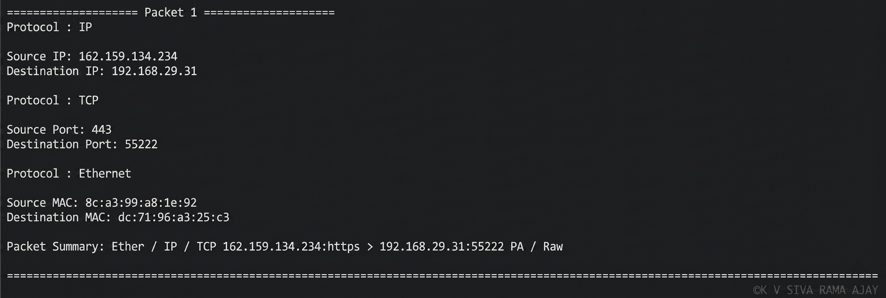
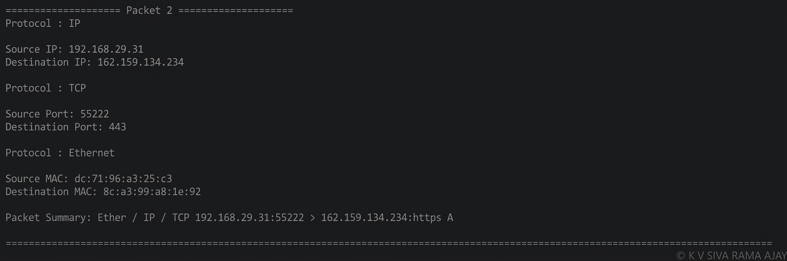
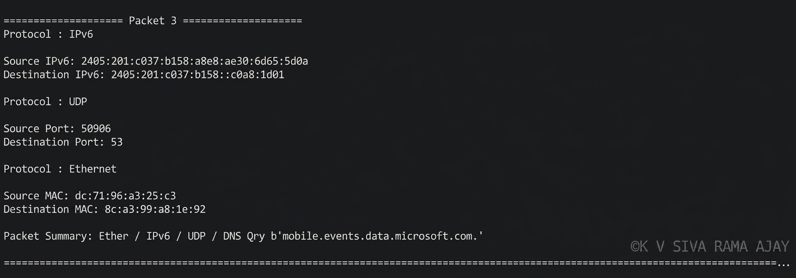
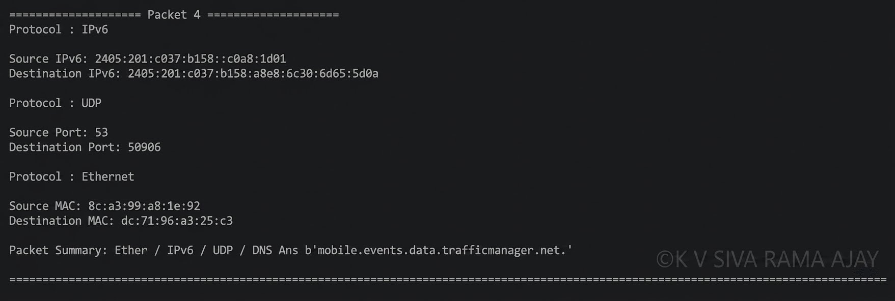

# Network Packet Sniffer

## 📌 Project Overview

This project is a simple Network Packet Sniffer developed using Python and the Scapy library. It captures network packets in real time and displays useful packet information such as IP addresses, MAC addresses, port numbers, protocol information, and packet summaries.

This project was developed as part of the CodeAlpha Cyber Security Internship.

---

## 🚀 Features

- Captures live network packets
- Displays Source and Destination IP addresses
- Displays Source and Destination MAC addresses
- Displays TCP and UDP Port Numbers
- Detects IPv4 and IPv6 packets
- Displays ICMP packet information
- Shows packet summary
- Displays packet count
- Clean and readable output

---

## 🛠 Technologies Used

- Python 3
- Scapy Library

---

## 📋 Requirements

Install the required library using:

```bash
pip install -r requirements.txt
```

Or install Scapy directly:

```bash
pip install scapy
```

---

## ▶️ How to Run

1. Clone the repository

```bash
git clone <repository-link>
```

2. Navigate to the project folder

```bash
cd CodeAlpha-Network-Sniffer
```

3. Install dependencies

```bash
pip install -r requirements.txt
```

4. Run the program

```bash
python network_sniffer.py
```

---

## 📷 Sample Output

### IPv4 Packet



---

### TCP Packet



---

### IPv6 Packet



---

### IPv6 Packet


---

### UDP Packet



## 📂 Project Structure

```
CodeAlpha-Network-Sniffer
│
├── network_sniffer.py
├── requirements.txt
├── README.md
└── screenshots
```

---

## 🔮 Future Improvements

- Add protocol filtering to capture specific packets.
- Save captured packets into a text file.
- Export captured packets to PCAP format.
- Improve packet analysis with additional protocol information.

---

## 👨‍💻 Author

Developed by K V SIVA RAMA AJAY

CodeAlpha Cyber Security Internship